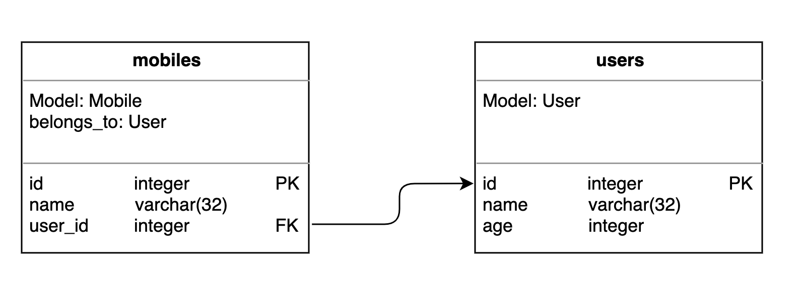
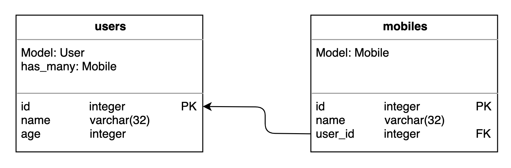
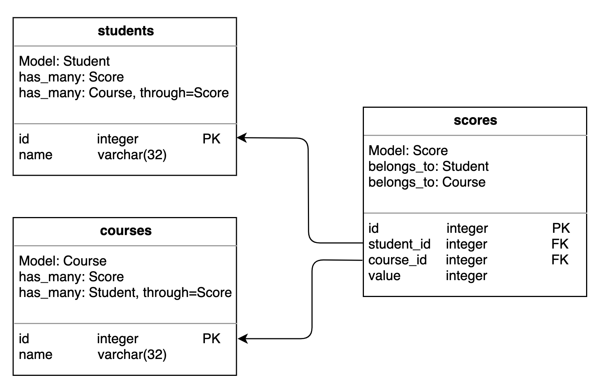
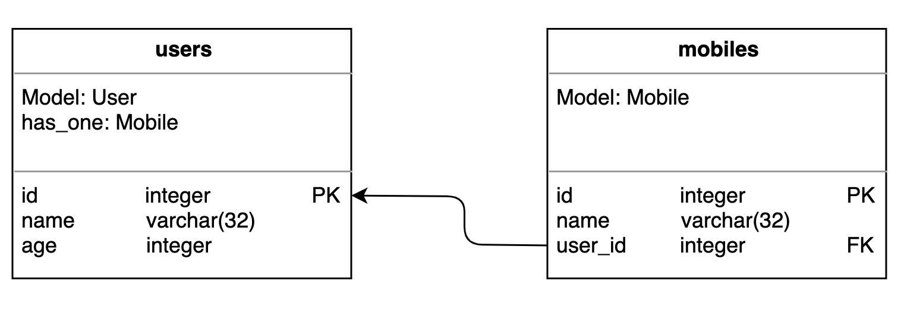
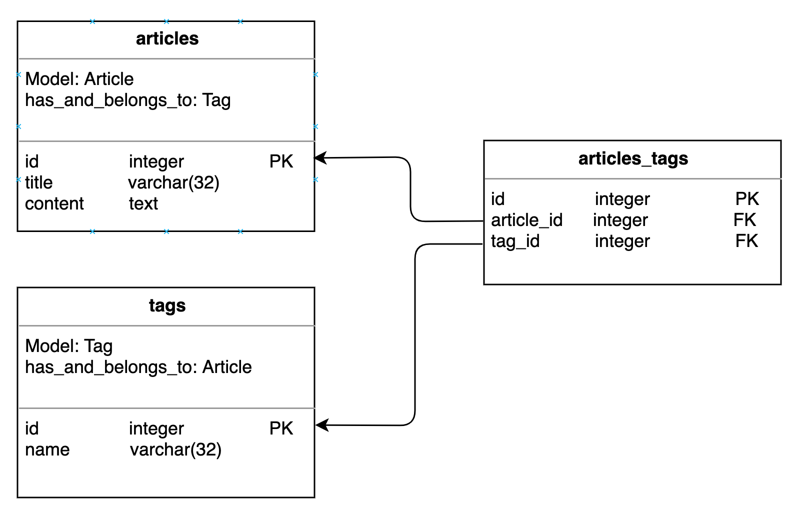
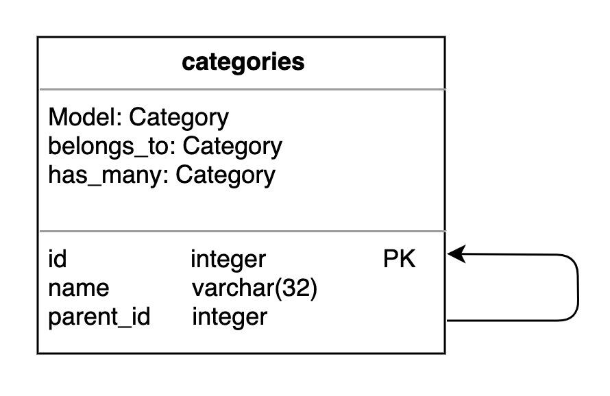

Associations
============

Belongs to 
----------

.. code-block:: SQL

  create table users (
    id int auto_increment primary key,
    name varchar(32) not null default '',
    age int not null default 20
  );

  create table mobiles (
    id int auto_increment primary key,
    name varchar(32) not null default '',
    user_id int not null,
    foreign key (user_id) references users(id)
  );

Define models
^^^^^^^^^^^^^

.. code-block:: python

  from sweet_orm.orm import Model
  from sweet_orm.orm.relations import belongs_to

  class User(Model):
    pass

  class Mobile(Model):
    belongs_to(User, name='user')  # name does not required. can be auto set

Create / Save
^^^^^^^^^^^^^

.. code-block:: python
  
  # create
  u = User.create(name="jon", age=20)
  Mobile.create(name="Nokia", user=u)
  Mobile.create(name="Nokia", user_id=u.id)

  # save
  u = User(name="jon", age=20).save()
  Mobile(name="Nokia", user=u).save()
  Mobile(name="Nokia", user_id=u.id).save()

Update
^^^^^^

.. code-block:: python

  u1 = User(name="jon", age=20).save()
  u2 = User(name="lily", age=30).save()
  m = Mobile(name="Nokia", user=u1).save()
  
  m.update(user=u2)
  m.update(user_id=u2.id)
  
  m.user = u2
  m.save()
  
  m.user_id = u2.id
  m.save()

Delete
^^^^^^

.. code-block:: python

  u = User(name="jon", age=20).save()
  m = Mobile(name="Nokia", user=u).save()
  m.delete()

Retrieving
^^^^^^^^^^

.. code-block:: python

  u = User.create(name="jon", age=20)
  m = Mobile.create(name="Nokia", user_id=u.id)
  m.user  # find user from database
  # SELECT * FROM `users` WHERE `users`.`mobile_id` = 1

Has many
--------

.. code-block: SQL

  create table users(
    create table users (
    id int auto_increment primary key,
    name varchar(32) not null default '',
    age int not null default 20
  );

  create table mobiles (
    id int auto_increment primary key,
    name varchar(32) not null default '',
    user_id int not null,
    foreign key (user_id) references users(id)
  );

Define models
^^^^^^^^^^^^^^

.. code-block:: python

  from sweet_orm.orm import Model
  from sweet_orm.orm.relations import has_many

  class Mobile(Model):
    pass

  class User(Model):
    has_many(Mobile)   #  if Mobile and User in same python file. 
                       #  you can coding that: 
                       # 
                       #  class User(Model):
                       #     has_many('xxx.yyy.Mobile')
                       #
                       #  note: 'xxx.yyy' is package of Mobile

Retrieving
^^^^^^^^^^

.. code-block:: python

  u = User.create(name="jon", age=20)
  Mobile.create(name="Nokia", user=u)
  Mobile.create(name="IPhone", user=u)
  Mobile.create(name="Vivo", user=u)
  
  u.mobiles.all()
  u.mobiles.first()
  u.mobiles.last()
  u.mobiles.where(name='IPhone').first()

Has many with through
---------------------

Define models
^^^^^^^^^^^^^

.. code-block:: python

  from sweet_orm.orm import Model
  from sweet_orm.orm.relations import belongs_to, has_many

  class Score(Model):
    belongs_to('Student')
    belongs_to('Course')

  class Student(Model):
    has_many(Score)
    has_many('Course', through=Score)

  class Course(Model):
    has_many(Score)
    has_many(Student, through=Score)

Retrieving
^^^^^^^^^^

.. code-block:: python

  s1 = Student.create(name='lily')
  s2 = Student.create(name='jon')

  c1 = Course.create(name='math')
  c2 = Course.create(name='sport')

  Score.create(student=s1, course=c1, value=100)
  Score.create(student=s1, course=c2, value=90)
  Score.create(student=s2, course=c1, value=95)
  Score.create(student=s2, course=c2, value=98)
  
  s1.courses.all()
  s2.courses.all()

  c1.students.all()
  c2.students.all()

Dissociate
^^^^^^^^^^

dissociate operate is a dynamic method of model. 

.. code-block:: python

  s1 = Student.create(name='lily')
  s2 = Student.create(name='jon')

  c1 = Course.create(name='math')
  c2 = Course.create(name='sport')

  Score.create(student=s1, course=c1, value=100)
  Score.create(student=s1, course=c2, value=90)
  Score.create(student=s2, course=c1, value=95)
  Score.create(student=s2, course=c2, value=98)
  
  Score.where(student_id=s1.id, course_id=c1.id).delete()
  s1.dissociate_with_scores(c1, c2)    # dissociate_with_scores   is a dynamic method. 
  c2.dissociate_with_students(s1, s2)  # dissociate_with_students is a dynamic method. 

Has one
--------
Has one association is a spectical has many association.

Define models
^^^^^^^^^^^^^

.. code-block:: python

  from sweet_orm.orm import Model
  from sweet_orm.orm.relations import has_one

  class Mobile(Model):
    pass

  class User(Model):
    has_one(Mobile)

Retrieving
^^^^^^^^^^

.. code-block:: python

  u = User.create(name="jon", age=20)
  Mobile.create(name="Nokia", user=u)
  print (u.mobile)

Has one with through
--------------------

Has one with through association is a spectical has many with through association.

  
Define models
^^^^^^^^^^^^^^
  
.. code-block:: python

  from sweet_orm.orm import Model
  from sweet_orm.orm.relations import belongs_to, has_one

  class Score(Model):
    belongs_to('Student')
    belongs_to('Course')

  class Student(Model):
    has_one(Score)
    has_one('Course', through=Score)

  class Course(Model):
    has_one(Score)
    has_one(Student, through=Score)

Retrieving
^^^^^^^^^^

.. code-block:: python

  s1 = Student.create(name='lily')
  s2 = Student.create(name='jon')

  c1 = Course.create(name='math')
  c2 = Course.create(name='sport')

  Score.create(student=s1, course=c1, value=100)
  Score.create(student=s2, course=c2, value=98)
  
  print (s1.course)
  print (s2.course)

  print (c1.student)
  print (c2.student)

Dissociate
^^^^^^^^^^

.. code-block:: python

  s1 = Student.create(name='lily')
  s2 = Student.create(name='jon')

  c1 = Course.create(name='math')
  c2 = Course.create(name='sport')

  Score.where(student_id=s1.id, course_id=c1.id).delete()
  s2.dissociate_with_score(c1)    # dissociate_with_score is a dynamic method. 
  c1.dissociate_with_student(s1)  # dissociate_with_student is a dynamic method. 

Has and belongs to many
-----------------------

Define models
^^^^^^^^^^^^^

.. code-block:: python

  from sweet_orm.orm import Model
  from sweet_orm.orm.relations import has_and_belongs_to_many

  class Article(Model):
    has_and_belongs_to_many('Tag')

  class Tag(Model):
    has_and_belongs_to_many(Article)

Associate 
^^^^^^^^^^

.. code-block:: python

  t1 = Tag.create(name='cartoon')
  t2 = Tag.create(name='movie')

  a1 = Article.create(title='title-1', content='content—1')
  a2 = Article.create(title='title-2', content='content—2')
  a3 = Article.create(title='title-3', content='content—3')
  a4 = Article.create(title='title-4', content='content—4')

  t1.associate_with_articles(a1)               # associate_with_articles is a dynamic method
  t1.associate_with_articles(a2, a3, a4)       # associate_with_articles is a dynamic method
  a1.associate_with_tags(t1, t2)               # associate_with_tags is a dynamic method

  t1.articles.all()
  a1.tags.all()

Dissociate
^^^^^^^^^^

.. code-block:: python

  t1 = Tag.create(name='cartoon')
  t2 = Tag.create(name='movie')

  a1 = Article.create(title='title-1', content='content—1')
  a2 = Article.create(title='title-2', content='content—2')
  a3 = Article.create(title='title-3', content='content—3')
  a4 = Article.create(title='title-4', content='content—4')

  t1.associate_with_articles(a1)               # associate_with_articles is a dynamic method
  t1.associate_with_articles(a2, a3, a4)       # associate_with_articles is a dynamic method
  a1.associate_with_tags(t1, t2)               # associate_with_tags is a dynamic method
  
  t1.dissociate_with_articles(a1, a2, a3, a4)  # dissociate_with_articles is a dynamic method
  a1.dissociate_with_tags(t1, t2)              # dissociate_with_tags is a dynamic method

Retrieving
^^^^^^^^^^

.. code-block:: python

  t = Tag.first()
  t.articles.all()
  
  a = Article.find(1)
  a.tags.all()

Association self
----------------

Define models
^^^^^^^^^^^^^

.. code-block:: python
  
  from sweet_orm.orm import Model
  from sweet_orm.orm.relations import has_many, belongs_to

  class Category(Model):
    has_many('Category', name='children', fk='parent_id')
    belongs_to('Category', name='parent', fk='parent_id')

Create
^^^^^^

.. code-block:: python

  c_root = Category.create(name="category-root")
  c_1 = Category.create(parent=c_root, name='category-1')
  c_1_1 = Category.create(parent=c_1, name='category-1-1')
  c_1_2 = Category.create(parent=c_1, name='category-1-2')

  c_2 = Category.create(parent=c_root, name='category-1')
  c_2_1 = Category.create(parent=c_2, name='category-2-1')
  c_2_2 = Category.create(parent=c_2, name='category-2-2')

Update
^^^^^^

.. code-block:: python

  c_root = Category.create(name="category-root")
  c_1 = Category.create(parent=c_root, name='category-1')
  c_1_1 = Category.create(parent=c_1, name='category-1-1')
  c_1_2 = Category.create(parent=c_1, name='category-1-2')

  c_2 = Category.create(parent=c_root, name='category-1')
  c_2_1 = Category.create(parent=c_2, name='category-2-1')
  c_2_2 = Category.create(parent=c_2, name='category-2-2')
  
  c_2_1.parent = c_1
  c_2_1.save()

  c_2_2.update(parent=c_1)

Retrieving
^^^^^^^^^^

.. code-block:: python

  c_root = Category.create(name="category-root")
  
  c_1 = Category.create(parent=c_root, name='category-1')
  c_1_1 = Category.create(parent=c_1, name='category-1-1')
  c_1_2 = Category.create(parent=c_1, name='category-1-2')

  c_2 = Category.create(parent=c_root, name='category-1')
  c_2_1 = Category.create(parent=c_2, name='category-2-1')
  c_2_2 = Category.create(parent=c_2, name='category-2-2')

  children = c_root.children.all()
  children = children[0].children.all()
  children = children[1].children.all()

N + 1
------

You can use `include` method to optimizate the N + 1 problem. 

For belongs_to 、has_one、has_many
^^^^^^^^^^^^^^^^^^^^^^^^^^^^^^^^^^

.. code-block:: python

  from sweet_orm.orm import Model
  from sweet_orm.orm.relations import *

  class User(Model):
    has_many('Mobile')
    has_one('Car')

  class Mobile(Model):
    belongs_to(User, name='user')

  class Car(Model):
    belongs_to(User)

  ######### N + 1 Example #########
  for m in Mobile.all(): # N + 1
    print (m.user)

  for u in User.all():   # N + 1
    print (u.car)
    print (u.mobiles.all())

  ######### Solution to N + 1  #########
  for m in Mobile.include("user").all(): # use include
    print (m.user)

  for u in User.include('car', 'mobiles').all(): # user include
    print (u.car)
    print (u.mobiles.all())

.. admonition:: Note
  
  Use include method should return a Collection. 

.. code-block:: python

  u = User.first()
  u.mobiles # return a Recordset

  u = User.include('mobiles').first()
  u.mobiles # return a Collection

For has_one with through、has_many with through
^^^^^^^^^^^^^^^^^^^^^^^^^^^^^^^^^^^^^^^^^^^^^^^

.. code-block:: python

  from sweet_orm.orm import Model
  from sweet_orm.orm.relations import *

  class Score(Model):
    belongs_to('Student')
    belongs_to('Course')

  class Student(Model):
    has_many(Score)
    has_many('Course', through=Score)

  class Course(Model):
    has_many(Score)
    has_many(Student, through=Score)
    
  for s in Student.include("courses").all():
    print (s.courses.all())

.. admonition:: Note
  
  ``has_one`` with through looks like ``has_many`` with through

For has_and_belongs_to_many
^^^^^^^^^^^^^^^^^^^^^^^^^^^^^^^

.. code-block:: python

  from sweet_orm.orm import Model
  from sweet_orm.orm.relations import *

  class Article(Model):
    has_and_belongs_to_many('Tag')

  class Tag(Model):
    has_and_belongs_to_many(Article)

  for t in Tag.include('articles').all():
    print (t.articles.all())
